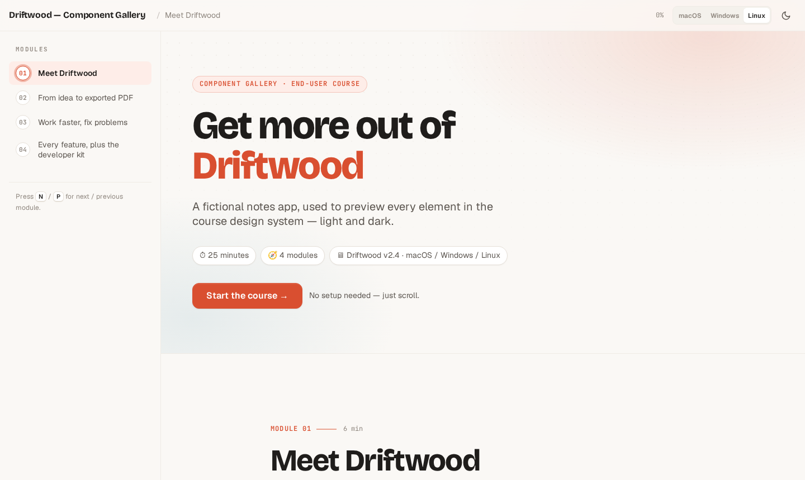
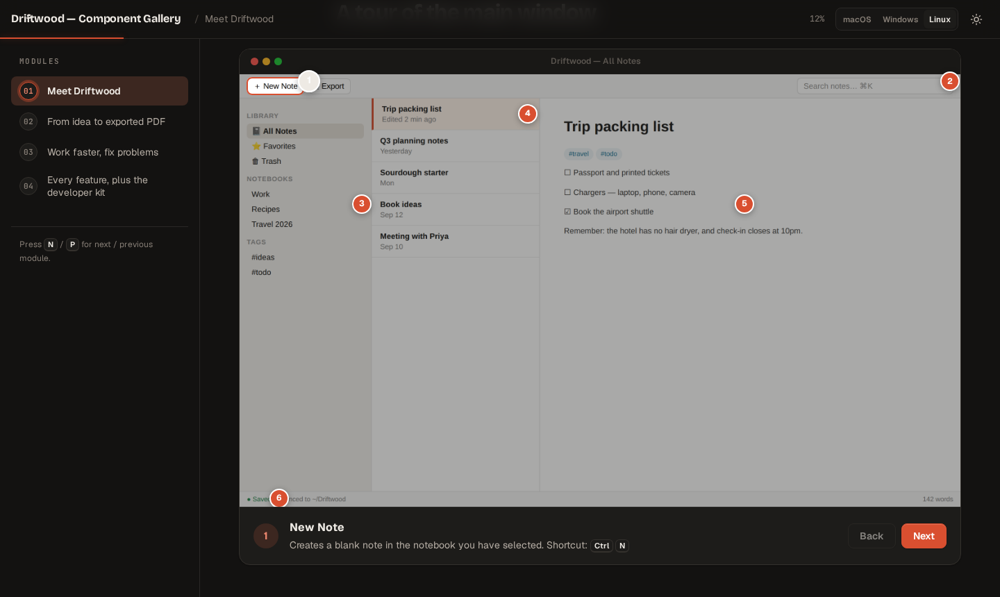

# Project to Course

A Claude Code skill that turns a project repository into a beautiful, interactive HTML course **for the people who use it**.

- **Apps** (Electron, Wails, Tauri, web, CLI) → an **end-user course**: how to use the app and get the most out of every feature, with real screenshots, guided UI tours, platform-aware keyboard shortcuts, settings, troubleshooting, and a searchable feature map.
- **Libraries, SDKs and developer tools** → a **developer-onboarding course**: the mental model, the public API, idiomatic usage, configuration, errors, and pitfalls — built from real examples and tests.
- **Any codebase, on request** → the original **"how the code works"** course for non-technical builders.




## Why build a course from the code?

Because the code is the most accurate manual that exists. It knows the exact menu labels, the real defaults and limits, every error message, and the shortcuts nobody documented. The skill reads it, then teaches in the learner's language — tasks and workflows for users, APIs and patterns for developers.

## Quick start

**1. Install** — clone into your Claude Code skills folder. The folder name should match the skill name, `project-to-course`:

```bash
git clone https://github.com/rgehrsitz/code-to-course ~/.claude/skills/project-to-course
```

**2. Use** — open any project in Claude Code and ask:

- *"Make a course for the users of this app"*
- *"Turn this library into an onboarding course for developers"*
- *"Create a user training course from https://github.com/owner/repo"*
- *"Explain this codebase interactively"* (internals mode)

Claude picks the mode from the project (or you can name it), analyzes the code, captures screenshots when it can run the app, and writes the course to a new folder. Open its `index.html` in any browser.

**3. Update** — `git -C ~/.claude/skills/project-to-course pull`

> **Tip:** if you also have the original `codebase-to-course` skill installed, both respond to phrases like "make a course". Say *"use project-to-course"* to pick this one, or uninstall the other.

### Requirements

- **Claude Code** plus **Bash** or **PowerShell** — to assemble the course (`build.sh`, or `build.ps1` on native Windows; Claude picks whichever is available). Viewing a finished course needs only a browser.
- **Node 18+ and Playwright** — only for automatic screenshots of your app (`npm i -D playwright` in the app repo). Without them, the course uses clearly labeled illustrations instead.
- Courses load fonts from Google Fonts. Offline they fall back to system fonts and everything else still works.

## What the course looks like

The output is a small **directory** (`index.html` + CSS/JS + screenshots) that opens in any browser and needs no build tools or server.

**Shell**
- Sidebar table of contents with per-module completion ✓, reading progress, "Up next" cards
- Light and dark mode (follows the OS, with a toggle), print-friendly, keyboard navigation (`N` / `P`)
- Fully responsive; respects reduced-motion settings; keyboard-accessible interactions

**End-user elements**
- **UI tours** — real screenshots with numbered hotspots, highlight regions and a step-through panel
- **Platform-aware shortcuts** — `⌘` on macOS, `Ctrl` on Windows/Linux, switchable from the top bar
- **Menu paths**, **action ↔ result** blocks, **setting cards** with real defaults, **error explainers**
- **Try-it checklists** that remember progress, and a **searchable feature map** of everything the app can do

**Developer elements**
- **Code ↔ English** translations, **API cards** with parameter tables, **do / don't** comparisons, language tabs that stay in sync

**Shared**
- Scenario quizzes that test *doing*, not remembering · group-chat and step-by-step flow animations · drag-and-drop matching · glossary tooltips · copyable code and terminal blocks

### See every element

[`examples/component-gallery/`](examples/component-gallery/) is a sample course for a fictional notes app that uses every element. GitHub shows HTML as source, so open it locally:

```bash
open ~/.claude/skills/project-to-course/examples/component-gallery/index.html      # macOS
xdg-open ~/.claude/skills/project-to-course/examples/component-gallery/index.html  # Linux
start %USERPROFILE%\.claude\skills\project-to-course\examples\component-gallery\index.html  # Windows
```

## Screenshots for desktop apps

Real screenshots make end-user courses much better. Claude tries, in order:

1. **Screenshots you already have** — a folder you point it to, or images in the repo (`docs/`, `screenshots/`, README images).
2. **Capturing them itself** with [`references/capture.cjs`](references/capture.cjs):
   - **Electron** — launches the app with Playwright, using the app's own Electron binary.
   - **Wails** — uses the dev server (`wails dev` → `http://localhost:34115`), where Go bindings still work. If the Go side can't build, it runs just the frontend and stubs the bindings with sample data.
   - **Tauri / web UIs** — the frontend dev server, with native bridges stubbed.
3. **Illustrations** — clearly labeled HTML mock-ups, when the app can't run.

The capture script also computes hotspot positions from real element positions, so tour markers land exactly on the controls they describe. To update a screenshot later, overwrite the PNG with the same name in the course's `screenshots/` folder; no rebuild is needed. To turn an illustration into a real screenshot, give Claude the image and ask it to swap it in (it edits that module and rebuilds). Full guide: [`references/screenshots.md`](references/screenshots.md).

You can also run the capture script yourself — describe the shots in a JSON file, then:

```bash
node ~/.claude/skills/project-to-course/references/capture.cjs shots.json
```

It writes the PNGs plus `hotspots.json` (ready-to-paste hotspot markup), and exits non-zero if any shot or hotspot failed. The file format is documented at the top of `capture.cjs`.

## Design philosophy

- **Teach jobs, not menus.** Modules follow what learners are trying to get done; exhaustive coverage lives in the feature map.
- **Accuracy is the product.** Labels, shortcuts, defaults, messages and code are copied exactly from the source.
- **Show, don't tell.** Every screen is at least half visual; max 2–3 sentences per text block.
- **Quizzes test doing.** "Sam needs to send just the #q3 notes as one PDF — fastest route?", not "Which menu is Export in?"
- **Fresh metaphors.** Each concept gets its own — never "restaurant".

## Customizing

- **Accent color** — each course sets one color in its `_base.html`; every other shade is derived from it, in light and dark mode.
- **Design system** — edit `references/styles.css` and `references/main.js`, then run `bash preview.sh` in `examples/component-gallery/` to see the result. New courses pick up the changes automatically.
- **Teaching style** — the audience files (`references/audience-*.md`) and `references/content-philosophy.md` control what each mode extracts and how it teaches.

## Skill structure

```
SKILL.md                         # Main instructions: mode selection, phases, build steps
references/
├── audience-end-user.md         # End-user mode: what to extract, module arc, required elements
├── audience-library.md          # Library mode
├── audience-internals.md        # Internals ("how the code works") mode
├── screenshots.md               # Getting screenshots of Electron / Wails / web apps
├── capture.cjs                  # Playwright capture + hotspot coordinate script
├── content-philosophy.md        # Accuracy, visual density, metaphors, tooltips, quizzes
├── interactive-elements.md      # HTML patterns for every element
├── design-system.md             # Tokens, typography, theming, layout
├── gotchas.md                   # Review checklist
├── module-brief-template.md     # Briefs for parallel module writing
├── styles.css · main.js         # Pre-built design system + engines (copied verbatim)
└── _base.html · _footer.html · build.sh · build.ps1
examples/component-gallery/      # Sample course showing every element (bash preview.sh to rebuild)
docs/                            # README preview images
```

## Credits

Forked from the original [codebase-to-course](https://x.com/zarazhangrui) skill by Zara, which teaches how a codebase works to non-technical builders — still available here as internals mode. This fork adds the end-user and library modes, screenshot capture, and a redesigned course kit. Built with Claude Code.
